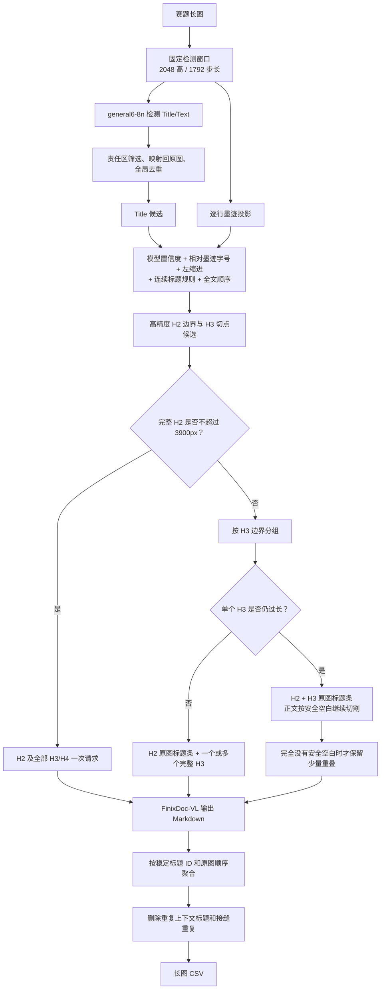

# 长图分支说明

长图默认使用 `semantic` 语义章节策略，同时完整保留原来的 `legacy` 自适应安全切块。两种策略共用固定检测窗口、general6-8n、原图坐标合并、API 缓存和 CSV 输出。

## 正式流程



小模型始终只看固定的 2048px 检测窗口。即使一个 H2 高几万像素，也不会把整个 H2 重新送进小模型。超长 H2 只影响最终的 FinixDoc-VL 请求规划。

## 两种策略

在 `config.example.json` 中选择：

```json
{
  "strategy": "semantic"
}
```

- `semantic`：默认正式流程。整 H2 优先，超长时按 H3，再按段落空白，最后才重叠切割。
- `legacy`：保留旧版“约 3200px 搜索安全空白带”的物理切割，不依赖标题层级。

如果 semantic 没有找到任何可靠 H2，会自动退回 legacy，不会因为标题检测失败而丢掉整张图。

## 标题证据

semantic 不用绝对字号直接硬判 H2，而是融合以下通用证据：

- general6 的 Title 置信度；
- Title 框中的实际墨迹行高与当前文档正文行高之比；
- 标题左缩进和是否居中；
- 用户提出的“连续 Title、中间无 Text”结构规律；
- 旧标题规则给出的参考层级；
- 全文标题先后关系。

只有高分且非居中的标题才作为 H2 物理边界。中低可信标题继续留在 H2 图片内部，由 FinixDoc-VL 判断真实层级。标题编号暂时由 FinixDoc-VL 读取；代码已经为以后“仅识别标题条的轻量 OCR”预留证据字段。

这些判断全部基于当前图片的相对比例，不按文件名、测试图坐标或固定章节数量写特殊分支。

## 超长 H2 的上下文图

如果完整 H2 超过输入限制，程序优先把相邻的若干完整 H3 组合到同一请求中，直到接近 3900px。后续请求顶部会粘贴该 H2 的原图标题条：

```text
┌────────────────────────────┐
│ H2 原图标题条              │
├────────细灰分隔线──────────┤
│ H3 标题及其完整正文        │
│ 下一个 H3 及其完整正文     │
└────────────────────────────┘
```

如果单个 H3 仍然过长，则每个续块携带 H2 与 H3 两条上下文。标题条直接裁自原图，不经过本地 OCR，也不重新绘制文字。

聚合主要使用清单里的 `context_heading_ids`、`visible_heading_ids` 和 `sequence`，标题文字相似度只用于确认是否安全删除重复标题，不承担定位职责。

## 代码阅读顺序

```text
步骤001_数据定义.py                 # 检测窗口、版面框、标题和安全块数据结构
步骤002_图片读写与裁切.py           # 原图裁切、H2/H3 标题条与正文复合图
步骤003_滑窗与YOLO检测.py           # 固定窗口、general6、责任区与全局去重
步骤004_语义标题分析.py             # 相对墨迹字号、证据加权和 H2/H3 推断
步骤004_自适应安全切块.py           # legacy 流程及 semantic 最后兜底
步骤005_大模型请求打包.py           # H2/H3 请求规划、Prompt 和重复标题去除
步骤006_全流程调度.py               # 准备、API、缓存、聚合和 CSV
步骤007_本地OCR识别.py              # 可选本地 OCR 后端，不是正式默认路径
```

早期连续 Title 标题树仍保留在：

```text
工具/工具004_旧标题层级分析.py
```

它现在是 semantic 的一项参考证据，也是 legacy/本地 OCR 的兼容实现，不再单独决定最终请求边界。

## 准备长图

```bash
/usr/bin/python3 main.py prepare-long \
  --input-dir "raw_data/AFAC A榜评测数据集(2)/finix_huge_long_rest_A/images" \
  --work-dir work/long \
  --config afac_pipeline/long/config.example.json
```

单图输出：

```text
prepared/<文件名_哈希>/
├── manifest.json
├── detection_windows/              # 固定小模型窗口
├── yolo_raw/                       # YOLO 自带标框及 predictions.json
├── semantic_audit/
│   ├── 005_标题层级证据.json
│   ├── 006_标题层级窗口图/         # H1/H2/H3 与分数画回窗口
│   └── 007_请求切块清单.json
├── vlm_request_parts/              # 每张复合请求的原始正文/标题条
└── vlm_requests/                   # 实际发送给 FinixDoc-VL 的图片
```

`manifest.json` 另外记录：

- `strategy`：本次实际策略；
- `semantic_headings`：全局标题 ID、层级、坐标和置信度；
- `semantic_analysis.evidence`：每个标题的完整打分依据；
- `semantic_cutting`：每个 H2 是整块还是按 H3 切分；
- `safe_chunks`：同图 legacy 对照结果；
- `request_packs`：实际请求顺序、正文框、上下文框和标题 ID。

## 调用 FinixDoc-VL

```bash
/usr/bin/python3 main.py run-long \
  --manifest work/long/dataset_manifest.json \
  --work-dir work/long \
  --credentials-file FinixDoc_VL调用.txt \
  --user-id finixB2002 \
  --request-timeout 240 \
  --max-retries 50 \
  --output-csv outputs/long_submission.csv
```

每个原始回答保存在 `responses/request_*.md`；删除重复上下文标题后、真正参与聚合的版本保存在 `responses/request_*_聚合输入.md`。

成功结果会即时写入 SQLite。API 繁忙时轮换官方白名单账号，并按第 n 次重试等待 `n × log₂(n)` 秒。

## 本地 OCR 备用线

本地 OCR 代码和旧工作目录都保留。它继续读取 `request_packs`，可用于 API 不可用、下一阶段快速试验或低置信度复核；正式默认后端仍是 FinixDoc-VL。

## 测试

```bash
/usr/bin/python3 -m unittest discover -s tests -v
```

真实单图验证结果位于：

```text
work/验证/长图语义_v1/输出_v2/
```

该样例高 30690px，检测出 7 个 H2、47 个 H3 候选，最终生成 13 张请求图；如果每个 H3 单独请求会有 44 张，因此当前实现会在不跨 H2 的前提下合并相邻完整 H3。
