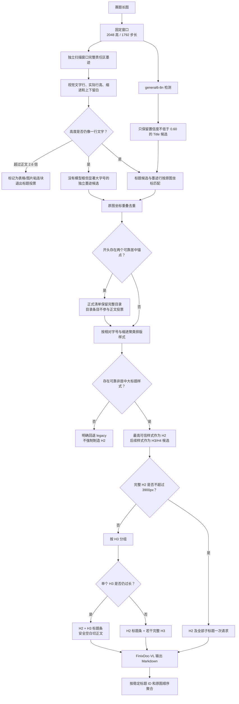

# 长图分支说明

长图默认使用 `semantic` 语义章节策略，`strategy=legacy` 保留旧窗口切块流程；自适应安全切割仍会作为超长 H3 的最后兜底。当前正式语义流程是 v3：严格小模型标题候选与全宽墨迹扫描彼此独立，同时拦截表格大块、删除跨窗口重复候选，并把目录区域与正文标题投票隔离。

## 正式流程



小模型始终只看固定窗口，不会接收整个超长 H2。H2 很长只影响最终大模型请求规划。

## 历史实现归档

已经退出正式流程的算法位于：

```text
归档/
├── 连续标题层级_v0.py
├── 语义标题分析_v1.py
└── README.md
```

- v0：连续 Title 组中第一个直接视为 H2，后续视为 H3。
- v1：模型、墨迹与旧规则加权，但“连续组开头”和“旧规则 H2”相关性过高，被重复计权。

正式 `semantic` 不再导入这些文件。本地 OCR 备用线为了兼容旧输出，可以显式调用 v0，但不影响 FinixDoc-VL 主流程。

## 两条独立证据链

### 小模型链

检测窗口参数：

```json
{
  "window_height": 2048,
  "window_step": 1792,
  "yolo_imgsz": 640,
  "yolo_base_confidence": 0.25,
  "title_confidence": 0.60
}
```

`yolo_base_confidence=0.25` 只用于保留版面框和安全切割保护。正式标题候选必须再次满足：

```text
Title confidence ≥ 0.60
```

低于 0.60 的 Title 不参与样式聚类，也不能借助其他分数重新变成模型标题。

### 独立墨迹链

墨迹分析读取窗口完整图片，不裁 YOLO Title/Text 框。

```json
{
  "semantic_ink_threshold": 225,
  "semantic_full_width_active_ratio": 0.002,
  "semantic_line_merge_gap": 2,
  "semantic_min_ink_line_height": 6,
  "semantic_min_ink_width_ratio": 0.02
}
```

- 灰度低于 225 视为墨迹。
- 一横行至少有 0.2% 墨迹才是活跃文字行。
- 相隔不超过 2px 的活跃行合并。
- 高度低于 6px 或宽度低于图片 2% 的小噪声删除。
- 每个窗口只保留中心位于自身 ownership 范围的文字行，避免重叠窗口重复。
- 全文视觉行高中位数作为正文字号基准。

因此，即使 YOLO 漏掉一个特别大的 H2，墨迹链仍能独立看到它。

## 候选准入

### 模型候选

模型 Title 必须与独立墨迹行匹配，并满足：

```json
"semantic_model_title_min_ratio": 1.05
```

即实际墨迹行高至少是本文中位字号的 1.05 倍。高置信度但与正文同字号的误框不能进入标题样式。

### 纯墨迹候选

没有模型 Title 支持时，必须同时满足：

```json
{
  "semantic_ink_only_title_ratio": 1.35,
  "semantic_ink_only_min_whitespace_ratio": 0.60
}
```

即字号至少为正文 1.35 倍，并有足够上下留白。纯墨迹候选采用更严格条件，避免普通粗体正文大量冒充标题。

### 三道防误判门

```json
{
  "semantic_title_max_height_ratio": 2.60,
  "semantic_h2_min_style_ratio": 1.20,
  "semantic_candidate_overlap_ratio": 0.65
}
```

- 墨迹块高于正文的 2.6 倍时，视为表格线、图片或多行文字粘连，不参与标题投票。
- H2 样式至少达到正文的 1.20 倍；只有轻微字号差异时回退 legacy，不强行制造章节。
- 两个候选在原图横向和纵向都重叠 65% 以上时，只保留模型支持更强、置信度更高的一个。

### 目录隔离

若图像开头先出现一个达到 0.60 的居中目录标题，后面又出现一个覆盖多行、明显更高的居中文档主标题，程序把两者之间标记为目录。正式预处理清单始终保留完整目录；如果高度超过 3900px，只等比例缩小最终 PNG。目录内条目不参与正文 H2/H3 样式聚类。

赛事 API 仍一次接收完整目录。本地 PaddleOCR-VL 若遇到压缩后会过窄的极端长图，会先检查正文中央是否存在贯穿大部分高度的竖向空白槽。检测到双栏目录后，按“左列自上而下、右列自上而下”的阅读顺序处理；每列再沿横向空白带生成临时子块，并在每块顶部复制同一个目录标题条。子块按列和原坐标聚合，重复目录标题只保留第一份；这不会改写 `manifest.json` 中的正式目录请求。

## 排版样式聚类

候选按照两个维度聚类：

- 实际墨迹行高 ÷ 正文字号；
- 左边距 ÷ 图片宽度。

参数：

```json
{
  "semantic_style_height_tolerance": 0.10,
  "semantic_style_indent_tolerance": 0.06,
  "semantic_h2_min_style_ratio": 1.20,
  "semantic_h2_cluster_height_tolerance": 0.08
}
```

- 字号差不超过 10%、缩进差不超过图片宽度 6% 的候选视为同一排版样式。
- H2 样式至少达到正文的 1.20 倍；低于该值不制造 H2。
- 最高的可靠非居中样式作为 H2。
- 与最高 H2 样式字号差不超过 8%、且没有更深缩进的相邻样式也可并入 H2。
- 其余可信样式按字号和缩进顺序成为 H3/H4 候选。
- 找不到可靠 H2 时直接回退 legacy，不选“最高分标题”凑数。

这里不再使用旧连续 Title 规则，也没有 H2 加权分数。

## H2/H3 请求规划

```json
{
  "max_vlm_height": 3900,
  "semantic_title_padding": 12,
  "semantic_context_gap": 10
}
```

- 完整 H2 不超过 3900px：整章一次请求。
- 超长 H2：相邻完整 H3 尽量组合到同一请求。
- 超长 H3：正文从 H3 标题下沿开始，顶部复制 H2+H3 原图标题条。
- 标题框会扩展到匹配墨迹的真实上下边缘，避免从模型框边缘切掉字。
- H2 前方完全空白时不生成单独的空请求。
- 目录在正式清单中不按正文切块；本地模型容量不足时只生成带重复目录头的临时子块。

超长 H3 的最终兜底仍使用：

```json
{
  "adaptive_target_height": 3200,
  "adaptive_min_height": 2200,
  "safe_cut_search": 600,
  "projection_blank_ratio": 0.01,
  "minimum_blank_band": 8,
  "vlm_overlap": 200
}
```

## 官方 API Markdown 后处理

官方接口严格不发送自定义提示词，但后台模型偶尔会把自己的英文任务说明复述到
结果开头。聚合前会识别并删除这段固定说明；空白页顶小块清理后为空时直接跳过，
不会把提示词写入最终文档。

每个请求块先按编号做通用层级校正，再使用 manifest 中的
`context_heading_ids`、`visible_heading_ids` 和 `heading_hints` 校准已知标题：

- 目录只把“目录”标题恢复为 H1，目录条目保持普通文本或表格；
- 正文 H1 只在预处理明确检测到 H1，且请求开头找到可靠文档标题短行时恢复；
- H2/H3/H4 只有编号形态与 manifest 层级相容时才覆盖，二者冲突时保留模型结果；
- “第一条”一类标题按 H3 处理，不再全部挤在 H2；
- 通用编号校正在请求块内完成，manifest 覆盖以后不再做第二次全局改写，因此
  `# 1 总则` 不会重新被降成 `## 1 总则`。

复制到续块顶部的祖先标题既按稳定 ID 去重，也按同一组 context ID 的开头短行块
去重。后者允许模型偶尔漏掉标题框中的一行，只删除相邻请求开头匹配的复制内容，
不会在全文范围删除同名正文。每个请求同时保留
`request_*_模型原始.md`、处理后的 `request_*.md` 和真正参与聚合的
`request_*_聚合输入.md`，方便逐层核对。

## 本地 Markdown 标题恢复

PaddleOCR-VL 的版面渲染有时会把不同层级统一输出成 `##`，整块 OCR 时也可能漏掉井号。本地后处理会结合 `manifest.json` 中已有的 H1/H2/H3/H4 标题检测结果，再按编号深度恢复 Markdown 层级：

```text
文档大标题        → # H1
1 总则 / 一、总则 → ## H2
1.1 保险责任      → ### H3
1.1.1 / （一）   → #### H4
更深编号          → ##### H5
```

原图检测到的标题数量会作为提升预算。只有预算仍有缺口的短编号行才会从普通文字提升，正文中的长句和普通枚举不会无上限变成标题。目录只把“目录”标题恢复为 H1，目录项仍是普通目录行，不会伪装成正文标题。

### FireRed 标题后处理

FireRed 有时能看出标题的粗体样式，却不输出 Markdown 井号。只有当整行粗体
候选数量与当前请求块的 manifest 标题数量完全一致时，程序才按已知 H2/H3/H4
顺序恢复；数量不一致时不强行提升。没有语义标题提示的 legacy 块，仅对至少
三项连续编号、且整行粗体的定义项恢复为 H4。连续两个 H1 会合成一条换行的
文档标题。该处理不读取保险产品名或固定条款关键词。

## 中间产物

```text
prepared/<文件名_哈希>/
├── manifest.json
├── detection_windows/
├── yolo_raw/
├── semantic_audit/
│   ├── 004_独立墨迹行窗口图/
│   ├── 005_严格模型标题窗口图/
│   ├── 006_标题样式聚类.json
│   ├── 006A_目录隔离窗口图/
│   ├── 006B_候选拒绝原因窗口图/
│   ├── 007_最终标题层级窗口图/
│   └── 008_请求切块清单.json
├── vlm_request_parts/
├── local_vl_parts/                    # 仅本地模型：极端长图临时子块、切点和子块缓存
├── vlm_requests/
└── 中文中间产物/
    ├── 000_原始图片.jpg
    ├── 滑窗切片/
    ├── YOLO原始标框/
    ├── 标题语义分析/
    └── 大模型输入切块/
```

长图也按单图 manifest 做断点复用，并在分支工作目录持续写入
`预处理错误汇总.json`、`预处理进度与错误汇总.csv` 和
`预处理进度与错误汇总.html`。中文中间产物使用硬链接，不重复占用大图空间。

`006_标题样式聚类.json` 包含：

- 每条独立墨迹行；
- 正文字号中位数；
- 每个严格模型候选及匹配墨迹；
- 纯墨迹候选；
- 排版样式簇；
- 最终 H1/H2/H3/H4；
- 被拒绝候选及原因；
- 是否需要回退 legacy。

## 代码阅读顺序

```text
步骤001_数据定义.py
步骤002_图片读写与裁切.py
步骤003_滑窗与YOLO检测.py
步骤004_语义标题分析.py
步骤004_自适应安全切块.py
步骤005_大模型请求打包.py
步骤006_全流程调度.py
步骤007_本地OCR识别.py
归档/
```

## 运行

```bash
/usr/bin/python3 main.py prepare-long \
  --input-dir "raw_data/finix_huge_long_rest_B/images" \
  --work-dir work/long \
  --config afac_pipeline/long/config.example.json

/usr/bin/python3 main.py run-long \
  --manifest work/long/dataset_manifest.json \
  --work-dir work/long \
  --credentials-file FinixDoc_VL调用.txt \
  --user-id finixB2002 \
  --output-csv outputs/long_submission.csv
```

每个 API 原始回答保存在 `responses/request_*.md`，去掉重复上下文标题后真正用于聚合的版本保存在 `responses/request_*_聚合输入.md`。

API 日志会同时打印原图名和请求切块名。连接超时、429/5xx 以及“识别失败、请求
过载、服务器繁忙”等临时故障会轮换账号并按平方退让，最多重试 15 次。单个长图
块退让耗尽后只记录该块并继续同一张图的下一块，不写成功缓存；一张图的所有块
都尝试完仍有缺块时，才将原图标记为不完整，写入图片目录下的
`recognition_failures.json`，然后继续下一张原图。成功块的 SQLite 缓存不会丢失，
重跑时只补失败块。长图没有表格物理行列，无法像图表那样生成同形状空矩阵；
一键模式在整图最终失败时用空 Markdown 占位并记录 `degraded`，以保证100行CSV；
底层严格模式仍按失败记录并等待后续重跑。

## 当前真实验证

同批五图前后对照目录：

```text
work/验证/长图语义_v2/多图验证_20260716/
work/验证/长图语义_v3/同批五图_20260716/
work/验证/长图语义_v3/目录整块回归_20260716/
```

| 图片 | v2 层级 | v3 层级 | v3 处理 |
| --- | --- | --- | --- |
| `1c3ec669...` | H2=1（误框表格） | H2=3、H3=9 | 拒绝 530px 高表格块 |
| `613ef75d...` | H2=2（两个重叠表格框） | 无可靠 H2 | 拒绝两个表格块并回退 legacy |
| `97953b4d...` | H1=1、H2=1、H3=4、H4=56 | TOC=1、H1=1、H2=7、H3=48 | 目录 y=106～4838 整块缩小后一次请求 |
| `5bd42e94...` | H2=7 | H2=7 | 正常样本保持不变 |
| `d71d562d...` | H2=7 | H2=7 | 正常样本保持不变 |
| `3ed0a71a...` | H2=1、H3=36 | H2=1、H3=36 | 最初样本回归结果完全不变 |

## 测试

```bash
/usr/bin/python3 -m unittest discover -s tests -v
```

测试明确覆盖 Title 0.60 门槛、模型与墨迹独立性、表格大块拦截、跨窗口候选去重、低字号 H2 回退、目录隔离与独立打包、样式层级、超长 H3 上下文以及重复标题去除。
