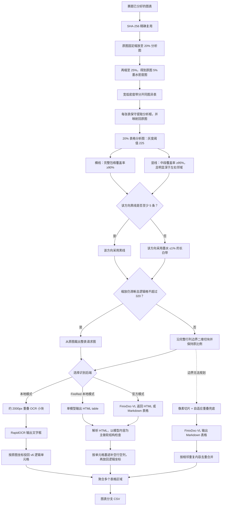

# 图表分支说明

图表分支只接收赛题已经分好的图表目录，不做自动路由。默认 `auto/ink`
已经正式使用 v6；`projection/yolo` 仅保留为历史对比入口。



## 1. 配置与检测器

配置示例为 `afac_pipeline/table/config.example.json`。检测器有四种模式：

- `auto`：正式默认，使用 v6 密度分表和黑白边界，不加载模型；
- `ink`：显式使用与 `auto` 相同的无模型定位；
- `yolo`：仅用于历史对比，强制使用配置的 YOLO 权重；
- `projection`：仅用于历史对比，使用旧横线投影定位。

v6 先把原图固定缩到 20%，再缩到该分析图的 25%，所以密度图固定为原图
5%。分表低密度点上限收紧为 2%，整条分隔带平均墨水上限为 1.5%。
如果下一张表的标题把宽空白带打断，切口固定放在标题上方，使标题归入
下面的表。每张分表再使用 1% 投影峰值和最低 0.05% 墨水比例保守取得
分析框，并向外留约短边 1% 的余量。

内部边界统一使用灰度阈值 225。横线候选在独立二维表格包络内必须至少有
90% 黑像素；竖线忽略包络两端各 5% 的不稳定区，中段至少有 95% 黑像素，
并且灰度均值要比左右邻域至少深 30，避免同列数字“1”的竖笔画被当成表线。
一个方向至少找到 5 条黑线才采用，否则该方向改用墨水比例不超过 1% 的
白带。找横向白带时文字只左右扩张 0.15%，找纵向白带时上下扩张 0.4%，
不再删除靠近分析框外沿的候选。所有检测坐标最终映射回原图，实际请求图
也始终从原图裁切。
赛题最大图固定缩放后最长边为 4455px，因此分析图安全上限设为 4608px；
这只限制内部分析图，不改变大模型或本地 OCR 请求图的 3900px 上限。

## 2. 准备图表

代码按真实执行流程编号，建议按下面顺序阅读：

```text
步骤001_墨水密度定位.py
步骤002_低密度分表.py
步骤003_区域检测器入口.py
步骤004_网格与白带检测.py
步骤005_黑线白带结构检测.py
步骤006_逻辑网格切块.py
步骤007_像素重叠切块.py
步骤008_Markdown表格合并.py
步骤009_HTML表格软对齐.py
步骤010_本地OCR识别.py
步骤011_全流程调度.py
工具/
归档/
```

```bash
python main.py prepare-tables \
  --input-dir "raw_data/AFAC A榜评测数据集(2)/finix_huge_table_rest_A/images" \
  --work-dir work/tables \
  --config afac_pipeline/table/config.example.json
```

该阶段不访问网络，输出：

```text
work/tables/
├── cache.sqlite3
├── dataset_manifest.json
└── prepared/<文件名_哈希>/
    ├── manifest.json
    ├── preview.png
    ├── preview_detected.png
    ├── density_detection/       # 密度图、分表带、分表框和实际分析框
    ├── grid_analysis/           # 各表分析图、边界图和诊断 JSON
    ├── tile_overlay.png         # 原图预览上的表框、逻辑边界和切块责任框
    ├── tile_contact_sheet.jpg   # 所有真实切块及其逻辑行列范围
    └── tiles/
```

`tile_overlay.png` 用于检查刀落在原图什么位置；`tile_contact_sheet.jpg`
用于逐块检查实际送模图片。联系图标题中的 `R[a,b)`、`C[a,b)` 表示该块
负责的逻辑行列范围。`header/stub` 默认均为 0，不再假设首行就是表头。

## 3. 切片原则

程序对横向执行“完整跨度 90%”，对纵向执行“中段 95% + 邻域深度差”。
两个方向都保持“黑线优先、白带兜底”。即使图片尺寸能
整体送入，只要逻辑总格子数超过 `max_logical_cells_per_tile=320`，就沿
完整逻辑行列边界做二维切块。内部空行、空列和空单元格全部保留，因为它们
决定全局对齐位置；默认不重复首行或首列。

黑线模式只把真正达到各自规则的线作为逻辑边界；带 padding 的分析框四边
不再自动伪装成表格线。所有模型请求图保持原始宽高比，禁止纵向拉伸；
若边界不足才使用带自适应重叠的像素切片。所有请求图最长边不超过 3900px。

## 4. 本地 OCR 与网格回填

```bash
PYTHONPATH=/tmp/afac_rapidocr python3 main.py run-local-tables \
  --manifest work/tables/dataset_manifest.json \
  --work-dir work/local_ocr \
  --output-csv outputs/table_local_ocr.csv
```

本地模式不会把 OCR 的视觉文字行直接猜成表格。每个请求图先分成约 2000px
的小块，避免把 3900px 表格压小；随后将所有 OCR 文字框从小块坐标映射到
请求图坐标，再映射到原图坐标，最后用 v6 行列边界定位单元格。重复表头和
行名列只作为识别上下文，不会被重复写入。

白带检测可能保留仅用于安全切割的冗余边界。本地后处理会删除整行或整列
完全没有任何 OCR 内容的边界，但保留真实单元格中的空值。最终结果以 HTML
`table/tr/td` 输出，并在 `local_ocr_quality/` 保存回填率和行列统计。

### FireRed-OCR 图表路径

FireRed 仍只实例化一份模型。长图输出上限保持 4096 token，图表单独提高到
8192 token，并使用独立缓存身份，因此调整图表参数不会让已完成的长图缓存
失效。FireRed内容是主要结果，预处理网格只作为软对齐参考。每个逻辑格会
记录是否存在文字墨迹；模型省略内部空列或整条空行时，后处理按墨迹顺序
补回 `<td></td>`。实际/参考结构不同会写入 `quality/region_*.json` 的
warning，但不会终止整张图片或整个CSV。

如果预处理确认某个逻辑切片的所有单元格内部都没有文字墨迹，流程会直接
按预处理行列数生成全空 HTML 表并跳过模型。模型或旧缓存返回空字符串时也
使用同一兜底；结果和原因一并写入 SQLite 缓存，重跑不会再次等待该切片。

实测使用同一个 23×24 数字表区域：560 格整块耗时 307.55 秒，
但撞到 8192 token 上限，HTML 在第 21 行中间截断；320 格切成四块后
共耗时 342.64 秒，160 格四块共耗时 339.99 秒，两者都输出了
行列数完整的 HTML。因此调小格子上限不是为了缩短总时间，而是为了
防止长输出截断。正式值选 320，不选 160，避免过度增加整个数据集的切片数。

## 5. 调用 FinixDoc-VL

```bash
python main.py run-tables \
  --manifest work/tables/dataset_manifest.json \
  --work-dir work/tables \
  --credentials-file FinixDoc_VL调用.txt \
  --user-id finixB2002 \
  --request-timeout 240 \
  --max-retries 15 \
  --output-csv outputs/table_submission.csv
```

公共客户端位于 `afac_pipeline/common/vlm_client.py`，按官方 multipart 协议上传图片并解析双层 JSON。每个切片响应写入 `responses/` 并进入 SQLite 缓存，中断后重跑不会重复请求成功切片；HTTP 200 的“服务器繁忙”HTML 会被识别为临时错误而不是 Markdown。

## 6. HTML 聚合、质量检查与失败策略

结构化路径解析 `th/td` 以及 `rowspan/colspan`，再按每块负责的逻辑坐标
放回全局矩阵。模型省略的空位通过原图单元格墨迹分布做顺序对齐；结构差异
只记录 warning。遇到无法解析或坐标冲突时保存 `merge_warning.json` 和原始
响应，并直接保留模型输出继续处理后续图片，不再让一张表中止一键脚本。

像素重叠兜底仍使用 Markdown 表格与相邻内容去重。这样无边框表格仍可运行，但不会被描述成已经完成了逻辑坐标合并。

当前 A 榜图表目录 50 张图片中有 49 个 SHA-256 唯一文件，可少解析 1 张完全重复图片。

## 7. 校验

```bash
python afac_pipeline/table/工具/工具001_检查准备结果.py --manifest work/tables/dataset_manifest.json
python -m unittest discover -s tests -v
```

### 无模型表格外轮廓实验

这个工具可以独立复现“强缩小后的二维墨水密度如何找到完整表格”，不负责内部行列判断：

```bash
python afac_pipeline/table/工具/工具002_墨水区域实验.py \
  --image "待测试图片.jpg" \
  --output-dir "work/验证/无模型墨水定位" \
  --yolo-manifest "原粗流程单图清单.json"
```

输出的 `004_最终墨水轮廓.png` 使用绿色多边形表示墨水外轮廓、红色矩形表示完整外接框；`005_墨水轮廓与YOLO对比.png` 额外使用蓝色矩形表示原 YOLO 表格框。

内部行列的正式优先级固定为：先使用传统横竖表格线；只有确认没有可靠表格线时，才使用行列长空白带。

### 暂存方案

横线和竖线分别使用非等比例分析图的方案暂不实施，设计细节保存在[非等比例缩放方案备忘](./归档/非等比例缩放方案备忘.md)。正式请求图始终保持原始宽高比。
