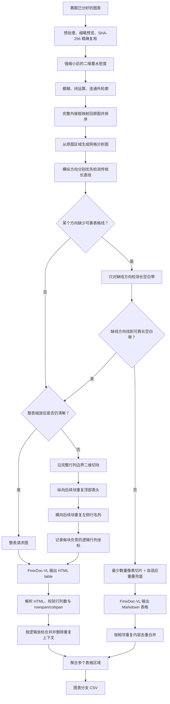

# 图表分支说明

图表分支只接收赛题已经分好的图表目录，不做自动路由。正式流程如下；虚线兜底只在无法得到可靠横纵网格时启用。



## 1. 配置与检测器

配置示例为 `afac_pipeline/table/config.example.json`。检测器有四种模式：

- `auto`：正式默认，使用低清二维墨水密度和连通外轮廓，不加载模型；
- `ink`：显式使用与 `auto` 相同的无模型定位；
- `yolo`：仅用于历史对比，强制使用配置的 YOLO 权重；
- `projection`：仅用于历史对比，使用旧横线投影定位。

墨水定位先把预览进一步缩到 384px 左右，使单元格内部小空隙模糊消失，再通过闭运算取得完整多边形轮廓和外接框。外接框映射回原图后才执行网格分析和裁切，小字不会因为定位预览缩放而丢失。

## 2. 准备图表

```bash
python main.py prepare-tables \
  --input-dir "raw_data/AFAC A榜评测数据集(2)/finix_huge_table_rest_A/images" \
  --work-dir work/tables \
  --config afac_pipeline/table/config.example.json
```

该阶段不访问网络，输出：

```text
work/tables/
├── cache.sqlite3
├── dataset_manifest.json
└── prepared/<文件名_哈希>/
    ├── manifest.json
    ├── preview.png
    ├── preview_detected.png
    ├── ink_detection/           # 墨水密度、连通块和完整轮廓审计图
    ├── grid_analysis/           # 原图区域及横竖边界审计图
    └── tiles/
```

`preview_detected.png` 用于快速检查漏表和错框；`manifest.json` 保存所有表格框、切片与原图坐标。

## 3. 切片原则

程序对横向和纵向分别优先检测传统长直线；只有某个方向没有可靠表格线时，才对该方向检测贯穿较长距离的空白带。表格等比缩到 `max_vlm_side` 后如果仍能保留配置要求的分辨率，就整体送入模型；否则只沿完整行列边界切块。纵向后续块会把顶部 `repeat_header_rows` 行拼回图片，横向后续块会把左侧 `repeat_stub_columns` 列拼回图片，默认均为 1。

若表格线和长空白带仍不足，程序使用最少数量的像素切片。160px 是目标重叠；当最少块容不下该重叠时会自动降低，而不会生成一张与前块几乎完全重复的尾图。所有请求图最长边不超过 3900px。

## 4. 调用 FinixDoc-VL

```bash
python main.py run-tables \
  --manifest work/tables/dataset_manifest.json \
  --work-dir work/tables \
  --credentials-file FinixDoc_VL调用.txt \
  --user-id finixB2002 \
  --request-timeout 240 \
  --max-retries 50 \
  --output-csv outputs/table_submission.csv
```

公共客户端位于 `afac_pipeline/common/vlm_client.py`，按官方 multipart 协议上传图片并解析双层 JSON。每个切片响应写入 `responses/` 并进入 SQLite 缓存，中断后重跑不会重复请求成功切片；HTTP 200 的“服务器繁忙”HTML 会被识别为临时错误而不是 Markdown。

## 5. HTML 聚合、质量检查与失败策略

结构化路径要求 FinixDoc-VL 输出 HTML 表格。程序解析 `th/td` 以及 `rowspan/colspan`，删除重复表头和行名上下文，再按每块负责的逻辑坐标放回全局矩阵。单块表格的实际/预期行列数写入 `quality/region_*.json`；多块表格行列数不符、坐标冲突或合并单元格互相覆盖时会停止聚合，并保存 `merge_error.json` 和全部原始响应。

像素重叠兜底仍使用 Markdown 表格与相邻内容去重。这样无边框表格仍可运行，但不会被描述成已经完成了逻辑坐标合并。

当前 A 榜图表目录 50 张图片中有 49 个 SHA-256 唯一文件，可少解析 1 张完全重复图片。

## 6. 校验

```bash
python afac_pipeline/table/tools/validate_prepared.py --manifest work/tables/dataset_manifest.json
python -m unittest discover -s tests -v
```

### 无模型表格外轮廓实验

这个工具可以独立复现“强缩小后的二维墨水密度如何找到完整表格”，不负责内部行列判断：

```bash
python afac_pipeline/table/tools/experiment_ink_region.py \
  --image "待测试图片.jpg" \
  --output-dir "work/验证/无模型墨水定位" \
  --yolo-manifest "原粗流程单图清单.json"
```

输出的 `004_最终墨水轮廓.png` 使用绿色多边形表示墨水外轮廓、红色矩形表示完整外接框；`005_墨水轮廓与YOLO对比.png` 额外使用蓝色矩形表示原 YOLO 表格框。

内部行列的正式优先级固定为：先使用传统横竖表格线；只有确认没有可靠表格线时，才使用行列长空白带。

### 暂存方案

横线和竖线分别使用非等比例分析图的方案暂不实施，设计细节保存在[非等比例缩放方案备忘](./非等比例缩放方案备忘.md)。
