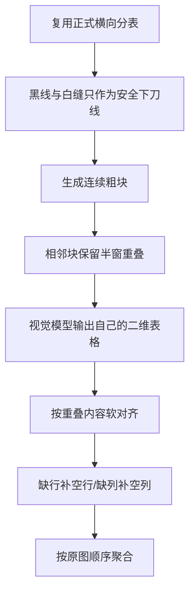

# 安全线粗切备用路线

这条路线用于保留“不强制恢复最终物理 R×C”的探索结果，当前不属于正式
图表一键流程，也不会被 FireRed 或官方 API 一键脚本自动调用。

## 放置位置

- 实验代码与完整说明：`tests/图表粗切实验/`
- 可视化和 API 抽查结果：`work/验证/安全线粗切带行列头V2/` 与
  `work/验证/安全线局部重叠V6/`
- 本文件：只负责在正式图表目录中留下入口，防止以后找不到这条路线。

## 路线概要

与正式流程最大的区别是：安全线只决定“在哪里切不伤字”，不决定最后必须
有多少行、多少列；最终结构优先相信模型输出。

## 当前结论

这条路线已证明“小安全块 + 连续半窗重叠”比任意像素大块稳定，但在
`1829aea8` 顶部梯形密表仍会出现男女数值交错。它适合作为未来处理
“正式 R×C 预处理 fatal”或“模型结构明显优于物理线”的备用方案，暂不适合
直接全量替换正式流程。

继续研究时从 `tests/图表粗切实验/README.md` 开始；其中列出了 001～011
实验脚本、已排除方案、当前推荐切法和可直接打开的检查页。
