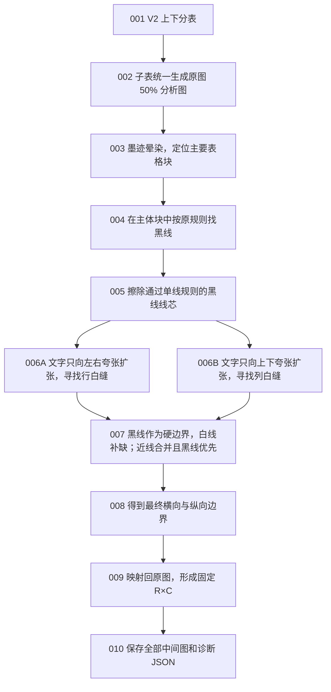

# 统一 50% 黑白划线实验

本目录只验证分表后的物理行列边界，不接正式流水线、切块或模型。

关键约束：

- 分表固定使用 `tests/图表分表实验/002_横向分表V2.py`；
- 表头打断白缝时，从上方白缝落刀，让表头归入下表；
- 50% 图只用于分析，实际识别图片仍保持原图原尺寸；
- 找行白缝时只左右扩张，找列白缝时只上下扩张；
- 当前扩张比例先统一测试 1%，后续按中间产物调整；
- 黑线规则暂时沿用正式代码，不在本实验中调参。
