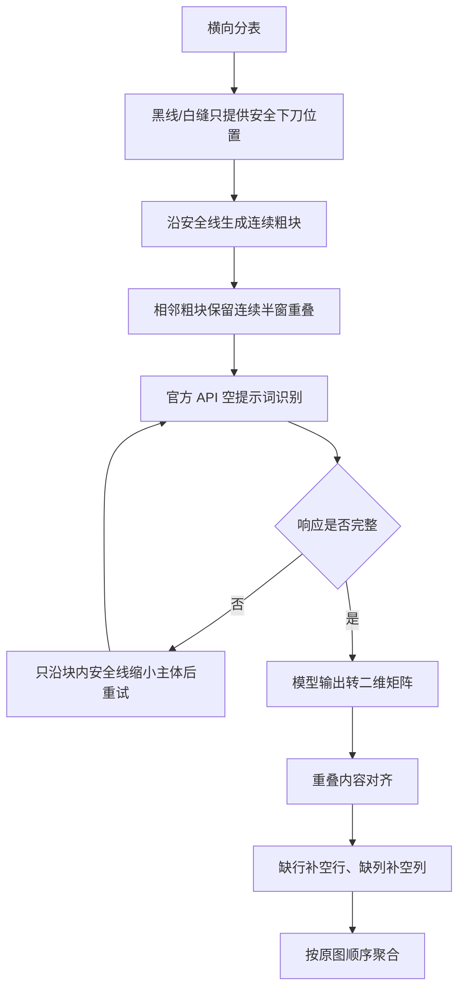

# 图表粗切实验

这里验证一条不再依赖最终物理 `R×C` 和墨迹 bool 矩阵的备用路线。
正式图表流程尚未切换；实验只复用已固化的横向分表和安全行列线。

## 当前推荐流程



这里的安全线不再决定最终表格必须有多少行、多少列；它只避免从文字中间
下刀，并控制单次模型输出量。最终二维结构以模型返回为准。

## 脚本顺序

| 编号 | 用途 |
|---|---|
| `001` | 旧的纯像素粗切基线；保留用于对照 |
| `002` | 检查模型矩阵尺寸和首列序列 |
| `003` | 离线检查已有安全线 API 响应，不发请求 |
| `004` | 生成带首行、首列上下文的安全线粗块 |
| `005` | 严格按官方方式抽查指定块，带独立 SQLite 缓存 |
| `006` | 左四列分类上下文实验 |
| `007` | 左五列行键实验 |
| `008` | 失败主体沿安全线二分实验；结果证明全局上下文不可靠 |
| `009` | 生成连续半窗重叠块；当前推荐切法 |
| `010` | 通用动态拼接对照 |
| `011` | 半窗重叠专用内锚点拼接；当前推荐后处理 |

旧版说明和首轮结论已移到 `归档/`，避免与当前实现混淆。

## 当前可查看结果

- 安全线切块总览：
  `work/验证/安全线粗切带行列头V2/1829aea8/01_安全线粗切总览.png`
- 261 个切块逐块检查页：
  `work/验证/安全线粗切带行列头V2/1829aea8/02_逐块检查.html`
- 半窗重叠 API 抽查汇总：
  `work/验证/安全线局部重叠V6/1829aea8/API抽查汇总.json`
- 半窗重叠最终抽查结果：
  `work/验证/安全线局部重叠V6/1829aea8/07_半窗重叠拼接/最终抽查结果.html`
- 详细拼接审计：
  `work/验证/安全线局部重叠V6/1829aea8/07_半窗重叠拼接/拼接汇总.json`

## 复现实验

下面命令只使用已经生成的 API 缓存做离线拼接：

```bash
/home/zero/miniconda3/envs/AFAC2026/bin/python \
  tests/图表粗切实验/011_拼接半窗重叠抽查.py \
  work/验证/安全线局部重叠V6/1829aea8
```

`005` 会真实调用官方 API。除非继续做小范围抽查，否则不要直接对 261 块
全量运行；`1829aea8` 一张图就有 310×113 个安全线段，输出量本身决定了它
不可能用少数几个大块稳定识别。

## 当前结论

详见 [实验结论.md](实验结论.md)。半窗局部重叠已经证明比纯像素大块、
全局首列拼图稳定，但 `1829aea8` 顶部梯形区域仍存在模型将男女数值读成交错
序列的问题。因此本路线暂不接入正式一键脚本。
